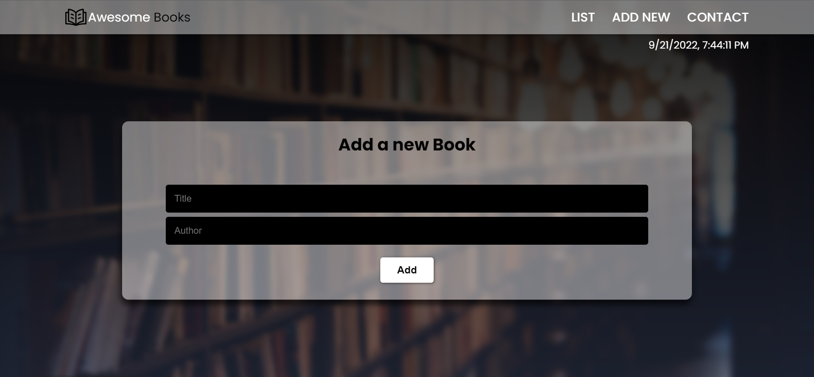

# Awesome Books

> The project models the local library. The books can be added and removed from the library. The books are added into the local storage of browser. The contact page is also designed to reach out to us for any query. The website works best for the desktop version.

## Built With

- HTML
- CSS
- Javascript

## Live Demo (if available)

[**See Project 🚀**](https://sajeelzafar.github.io/Book_Website/)

## Screenshot



## Getting Started

To get a local copy up and running follow these simple example steps.

### Prerequisites

To understand the project you must have a basic knowledge about HTML, CSS and Javascript.

### Setup

To run this project one must have Visual Studio (VS) Code installed and running.

### Usage

Clone and access the repository using the following commands on Git Bash:

  ```
   cd PATH 
   git clone _https://github.com/Sajeelzafar/Book_Website.git_
   cd _awesome-books_
  _index.html_ 
  ```

Open the directory in visual studio code by typing the following command in Git Bash:

 ```
 code .
  ```
Then using the live server of VS Code you can view the page.

## Authors

👤 **Author1**

- GitHub: [@Sajeelzafar](https://github.com/Sajeelzafar)
- Twitter: [@SajeelZafar6](https://twitter.com/SajeelZafar6)
- LinkedIn: [Sajeel Zafar](https://www.linkedin.com/in/sajeelzafar/)

👤 **Author2**

- GitHub: [@Dave Zag](https://github.com/DaveZag)
- Twitter: [@Dave Zagabe](https://twitter.com/davezagabe2)
- LinkedIn: [@Dave Zagabe](https://www.linkedin.com/in/dave-zagabe-03597a247/)

## 🤝 Contributing

Contributions, issues, and feature requests are welcome!

Feel free to check the [issues page](../../issues/).

## Show your support

Give a ⭐️ if you like this project!

## Acknowledgments

- Hat tip to anyone whose code was used

## 📝 License

This project is [MIT](./LICENSE) licensed.

_NOTE: we recommend using the [MIT license](https://choosealicense.com/licenses/mit/) - you can set it up quickly by [using templates available on GitHub](https://docs.github.com/en/communities/setting-up-your-project-for-healthy-contributions/adding-a-license-to-a-repository). You can also use [any other license](https://choosealicense.com/licenses/) if you wish._
